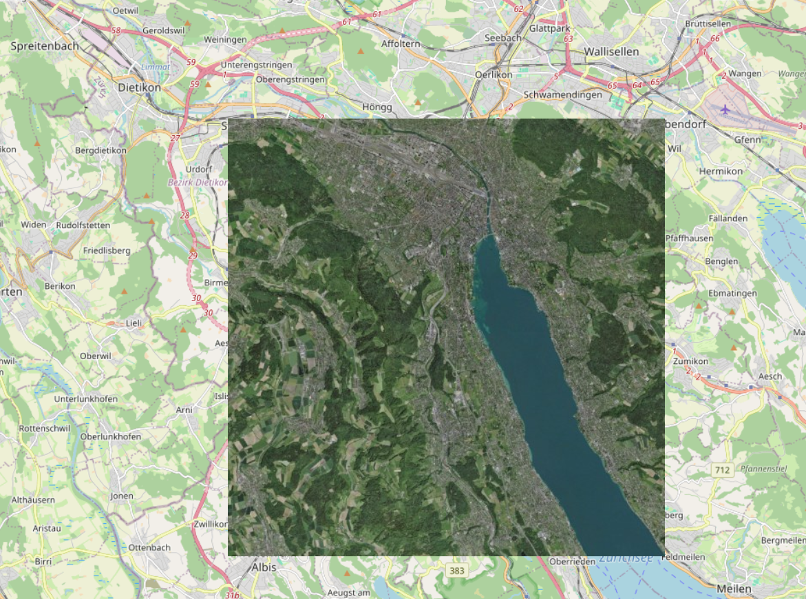

# raster-sources-mosaic
Combine multiple raster sources into one with MapLibre GL JS addProtocol

## demo

### Satellite

https://wipfli.github.io/raster-sources-mosaic/

### Terrain

https://wipfli.github.io/raster-sources-mosaic/terrain.html

